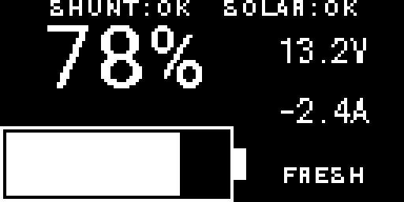
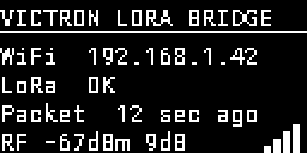

# ESPHome Victron LoRa Bridge

A two-node, read-only telemetry bridge that carries Victron SmartShunt and
SmartSolar data from an off-grid system over a long-distance 2.4 GHz LoRa link
to a Wi-Fi-connected ESPHome node, which publishes the data to Home Assistant.

## The use case

Victron Smart devices broadcast useful battery and solar telemetry over
Bluetooth, but Bluetooth range is limited. A camper van, RV, boat, shed, or
other off-grid system may be parked close enough for a point-to-point radio
link while still being outside reliable Bluetooth or Wi-Fi coverage. Adding
the vehicle itself to the home network may also be undesirable.

This project places one ESP32 beside the Victron equipment and another inside
the Wi-Fi-covered building:

```text
SmartShunt + SmartSolar
        │ encrypted Victron BLE advertisements
        ▼
offline Victron BLE LoRa node
        │ encrypted SX1280 packet transport
        ▼
Wi-Fi-connected uplink node
        │ encrypted ESPHome API
        ▼
Home Assistant
```

The Victron BLE LoRa node listens passively for Victron advertisements and
periodically sends a complete telemetry snapshot. The uplink node validates the packet,
rejects replays, and exposes the remote measurements as native ESPHome
entities. Both nodes have a small status display for local troubleshooting.
Each OLED wakes for 30 seconds at startup and then switches its panel off to
prevent burn-in. Pressing the board's BOOT button while the display is off
wakes it on its home screen for another 30 seconds. While the uplink display is
active, each press switches between its link-status home screen and remote
battery-data screen and restarts the timeout. The van display remains
single-page, so an active press only restarts its timeout.

## What it reports

- SmartShunt voltage, current, power, state of charge, consumed amp-hours,
  remaining time, and alarm state
- SmartSolar battery voltage, charge current, PV power, daily yield, charger
  state, and error code
- Source-data age, radio signal quality, packet counts, failures, drops, and
  link freshness

This is a monitoring bridge only. It does not send commands to Victron devices
and should not be used as the sole source of safety-critical alarms.

## Architecture and design choices

| Node | Role | Network access |
| --- | --- | --- |
| `victron-ble-lora` | Decode Victron BLE and transmit SX1280 snapshots | None in production firmware |
| `victron-lora-bridge` | Receive SX1280 snapshots and publish ESPHome entities | Wi-Fi, encrypted API, OTA, and local web UI |

- The production Victron BLE LoRa firmware contains no Wi-Fi, API, OTA, or MQTT
  services. A separate maintenance image temporarily enables
  Wi-Fi, API, and OTA while servicing the node.
- Radio payloads use ESPHome packet-transport encryption and rolling codes.
  The receiver authenticates packets before publishing any state and rejects
  repeated rolling codes.
- The local SX1280 driver bounds queues and packet sizes, performs radio fault
  recovery outside interrupt handlers, and enforces the board's 3 dBm SX1280
  drive limit.
- Sensor values become unavailable when their Victron source has not produced
  a valid advertisement for two minutes. Link diagnostics distinguish stale
  source data from radio failure.

> [!NOTE]
> This project uses 2.4 GHz LoRa because I already had compatible SX1280 boards,
> not because 2.4 GHz is the best band for this application. A region-appropriate
> sub-GHz LoRa radio, such as an 868 or 915 MHz design, would generally provide
> better propagation and range around a van or similar installation. Sub-GHz
> hardware is not a drop-in replacement for the SX1280 boards and configuration
> supplied here, and permitted frequencies vary by region.

## Hardware

The supplied configuration targets:

- Two **LILYGO T3S3 V1.1 SX1280PA** boards
- Two suitable 2.4 GHz antennas
- Two SSD1306 128×64 I²C OLED displays at address `0x3C`
- A supported Victron SmartShunt and SmartSolar charger

> [!CAUTION]
> Confirm that each board is the populated SX1280PA variant and attach the
> correct antenna before powering a transmitter. The PA control pins and
> 3 dBm drive cap are specific to this board. Using the wrong board revision,
> pinout, antenna, or output level may damage the radio front end.

Read the [hardware qualification and deployment guide](docs/deployment.md)
before flashing either board.

## Installation

Development and deployment are reproducible through the included Nix flake.
The lockfile pins ESPHome 2026.7.3 and the Python tooling used by the project.
Install Nix with flakes enabled, check out this repository, and enter the
development shell:

```sh
nix develop
```

Entering the shell automatically runs `uv sync --locked` to create or update
the project-local Python environment. Do not install project dependencies
system-wide. All commands below assume they are run from the repository root
with this development shell active.

## Getting started

### 1. Enable Victron Instant Readout

The van node never connects to or changes the Victron devices. It passively
listens for their encrypted Bluetooth **Instant Readout** advertisements, which
are disabled by default and must be enabled on both the SmartShunt and
SmartSolar before this bridge can receive telemetry.

For each device in VictronConnect:

1. Connect to the device and open its settings.
2. Open the three-dot menu and select **Product info**.
3. Enable **Instant readout via Bluetooth**.
4. Open **Instant readout details**, select **SHOW**, and securely record the
   device's Bluetooth MAC address and advertisement encryption key for the next
   step.

Repeat this for both devices. If Instant Readout is disabled or either identity
or key is incorrect, the bridge will show the corresponding readings as
unavailable. See Victron's
[Instant Readout instructions](https://www.victronenergy.com/media/pg/VictronConnect_app/en/stored-trends---instant-readout.html)
for the current VictronConnect workflow.

### 2. Configure secrets

Copy the environment template and fill in the two Victron MAC addresses and
advertisement keys, uplink Wi-Fi credentials, ESPHome API and OTA credentials,
and a shared packet-transport passphrase:

```sh
cp .env.example .env
$EDITOR .env
uv run python scripts/generate_secrets.py
```

The generator validates the values and writes the ignored
`esphome/secrets.yaml` with mode `0600`. Neither `.env` nor
`esphome/secrets.yaml` should be committed.

If you use 1Password, the optional injector can populate the Victron and Wi-Fi
fields before generating `secrets.yaml`:

```sh
uv run python scripts/inject_1password.py
```

Replace the randomly generated 1Password example identifiers with the item and
vault settings for your installation as described in the
[1Password integration guide](docs/1password.md).

### 3. Validate and build both nodes

```sh
uv run esphome config esphome/victron.yml
uv run esphome config esphome/bridge.yml
uv run esphome compile esphome/victron.yml
uv run esphome compile esphome/bridge.yml
```

### 4. Flash and connect

Flash `esphome/victron.yml` to the Victron BLE LoRa node over USB. Flash
`esphome/bridge.yml` to the uplink node, then add `victron-ble-lora-uplink` to Home
Assistant through the ESPHome integration. The uplink OLED and diagnostic
entities show radio reception, authentication status, signal strength, packet
age, and a paged view of the remote battery data.

Use `esphome/victron-maintenance.yml` only when the Victron BLE LoRa node needs temporary
network access, then restore the production image.

## Development

Run the automated checks with:

```sh
uv run pytest
uv run ruff check .
nix flake check
```

### Preview the OLED displays

The OLED layouts can be rendered locally without flashing either board. The
renderer writes a native 128×64 monochrome PNG and, by default, a 4× enlarged
nearest-neighbor preview:





```sh
uv run python scripts/render_oled.py \
  --node van --soc 78 --voltage 13.2 --current=-2.4 --output van.png
uv run python scripts/render_oled.py \
  --node uplink --wifi connected --link ok --age 12 --rssi=-67 --snr 9 \
  --output uplink.png
uv run python scripts/render_oled.py \
  --node uplink --page battery --soc 78 --voltage 13.2 --current=-2.4 \
  --output uplink-battery.png
```

Use `unknown` for an unavailable numeric value, `--no-shunt-fresh` or
`--no-solar-fresh` for stale van data, and `--scale 1` to suppress the enlarged
image. The renderer uses ESPHome's cached Roboto Mono font; if it has not been
downloaded yet, validate `esphome/victron.yml` once before rendering.

The repository includes a raw-radio fixture for bench testing independently of
Victron BLE. Before relying on an installed link, follow the packet-loss,
power-cycle, stale-data, and soak-test checklist in the
[deployment guide](docs/deployment.md).

## Documentation

- [Deployment, hardware qualification, and acceptance testing](docs/deployment.md)
- [SX1280 component configuration and behavior](docs/sx1280-component.md)
- [Optional 1Password secret injection](docs/1password.md)

## License

Released under the [MIT License](LICENSE).

## Legal disclaimer

This is an independent, unofficial open-source project. It is not affiliated
with, endorsed by, sponsored by, or supported by Victron Energy B.V. The
Victron Energy name and related product names and marks belong to their
respective owners and are used here solely to identify compatible equipment.
Their use does not imply any association with or approval by Victron Energy.

This software is provided without warranty under the terms of the MIT License.
